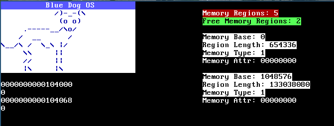

# OS Dev
Code repository of the [Poncho tutorial series](https://www.youtube.com/watch?v=7LTB4aLI7r0&list=PLxN4E629pPnKKqYsNVXpmCza8l0Jb6l8-) of Operating System development, from videos #2 to #25.

<p align="center">
  
</p>

Each folder is the code of its respective video. Of course with small modifications of their own. but it can be useful for new users.


# Environment
```
Linux notebook 5.3.0-64-generic #58-Ubuntu SMP Fri Jul 10 19:33:51 UTC 2020 x86_64 x86_64 x86_64 GNU/Linux
```

### Run

To run, enter any folder and run the ```./compilar.sh``` file.
Make sure you have qemu installed and other dependencies cited in 1# video.


```sh
$ ./compilar.sh
```

